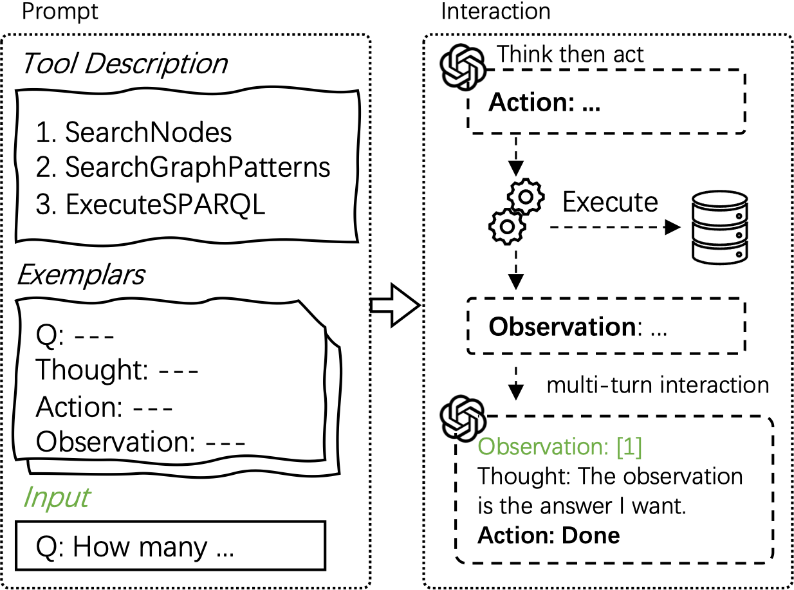

# Interactive-KBQA

This repository contains the official code for ACL 2024 paper "Interactive-KBQA: Multi-Turn Interactions for Knowledge Base Question Answering with Large Language Models"

<div align="center">

[](https://aclanthology.org/2024.acl-long.569)
[](TBC)
[](https://arxiv.org/abs/2402.15131)

</div>

This figure illustrates the overall process.

<div align="center">
  
</div>


## DB and Tool Setup

We have provided a comprehensive, beginner-friendly tutorial that meticulously outlines the process of building our tools from raw DB files. All tools are encapsulated to support asynchronous invocation via HTTP APIs.

For a detailed setup guide, please refer to [Database and Tool Setup](./doc/db_and_tool_setup.md).

## Dataset Preparation

For a detailed dataset preparation process, please refer to [Dataset Preparation](./doc/dataset_preparation.md).

## Interaction Process

Make sure all tools are available and running before proceeding.

### Question Type Classifier

To begin, we utilize the `bert-base-uncased` model to predict question types (no need to for WebQSP and MetaQA).

We have already uploaded the prediction results for the question type classifier. You can find them in the `data_preprocess` directory.

Alternatively, you can opt to train the model from scratch. Given the small size of the dataset, the training process is fast. Please ensure that you place the pretrained model in the `LLMs/bert-base-uncased` directory.

```bash
# training
python classifier/bert_for_cwq.py
python classifier/bert_for_kqapro.py

# inference
python classifier/bert_for_cwq_infer.py
python classifier/bert_for_kqapro_infer.py
```

You will observe the following output folders for model weights:
```
result-cwq-classification/best_model
result-kqapro-classification/best_model
```
and the prediction results:
```
data_preprocess/cwq-classification-prediction.json
data_preprocess/kqapro-classification-prediction.json
```

### Interaction

Run the following commands to interact with the GPT-4 model.

```bash
# WebQSP
python llm_interactive_kbqa.py --dataset webqsp --model_name gpt-4-1106-preview

# WebQSP (golden entity)
python llm_interactive_kbqa.py --dataset webqsp --model_name gpt-4-1106-preview --entity golden

# CWQ (conjunction)
python llm_interactive_kbqa.py --dataset cwq --model_name gpt-4-1106-preview --qtype conjunction

# CWQ (conjunction + golden entity)
python llm_interactive_kbqa.py --dataset cwq --model_name gpt-4-1106-preview --qtype conjunction --entity golden

# KQA Pro (Count)
python llm_interactive_kbqa.py --dataset kqapro --model_name gpt-4-1106-preview --qtype Count

# MetaQA
python llm_interactive_kbqa.py --dataset metaqa --model_name gpt-4-1106-preview
```

You can find additional command usage instructions in the comments within the corresponding python file.

## Evaluation


The path of the prediction files follows a specific pattern, for example:
```
save-qa-infer-dialog/webqsp/gpt-4-1106-preview/WebQTest-xxx.json
save-qa-infer-dialog/webqsp-golden/gpt-4-1106-preview/WebQTest-xxx.json
```

check the evaluation code in the `script` folder. 
```bash
python script/eval_all_webqsp.py
python script/eval_all_cwq.py
python script/eval_all_kqapro.py
python script/eval_all_metaqa.py
```

## Fine-tuning open-source LLMs

Based on our human-annotated data (`human-anno.zip`), we can effectively train open-source large language models.

We segment our training data according to the database.

To train these models, we utilize DeepSpeed ZeRO-3 optimization on a setup of 2*NVIDIA A100 80G GPUs.

```bash
# unzip the human-anno.zip file, the structure should be like this: human-anno/webqsp ...

# Training
bash script/webqsp+cwq/train_dialog_ds_zero3.sh
bash script/kqapro/train_dialog_ds_zero3.sh
bash script/metaqa/train_dialog_ds_zero3.sh

# Start Inference API
bash script/webqsp+cwq/infer_api_dialog_vLLM.sh
bash script/kqapro/infer_api_dialog_vLLM.sh
bash script/metaqa/infer_api_dialog_vLLM.sh

# Run interaction with the fine-tuned model
python llm_infer_finetuned_dialog.py --dataset webqsp --model_name Merge-Mistral-7B-v0.1-full-zero3-epoch10
python llm_infer_finetuned_dialog.py --dataset cwq --model_name Merge-Mistral-7B-v0.1-full-zero3-epoch10
python llm_infer_finetuned_dialog.py --dataset kqapro --model_name Mistral-7B-v0.1-full-zero3-epoch10
python llm_infer_finetuned_dialog.py --dataset metaqa --model_name Mistral-7B-v0.1-full-zero3-epoch10

# Evaluation
# see details in the `script/eval_all_xxx.py` file
```

## Human annotation

we also release the annotation code for the further development of NLP community. You are welcome to contribute more human-annotated data.

```bash
# WebQSP
python llm_anno_human_webqsp.py --qtype chain_len_1

# CWQ
python llm_anno_human_cwq.py --qtype comparative

# KQA Pro
python llm_anno_human_kqapro.py --qtype Count

# MetaQA
python llm_anno_human_metaqa.py --qtype 1-hop
```
You can find additional command usage instructions in the comments within the corresponding python file.


## More Experiments

We have provided the code to reproduce the baselines (IO and CoT prompt) in our paper.
```bash
python llm_infer_directly.py --dataset webqsp --model_name gpt-4-1106-preview --setting cot-answer --n 6
python llm_infer_directly.py --dataset cwq --model_name gpt-4-1106-preview --setting cot-answer --n 6
python llm_infer_directly.py --dataset kqapro --setting cot-answer --n 6
```

We also provide the code to reproduce the ablation study (the impact of question type classification). You can check the code and follow the instructions in the comments.
```bash
python llm_infer_baseline_dialog_ablation.py --dataset=cwq --model_name=gpt-4-1106-preview --setting=4-shot
python llm_infer_baseline_dialog_ablation.py --dataset=kqapro --model_name=gpt-4-1106-preview --setting=4-shot-01
python llm_infer_baseline_dialog_ablation.py --dataset=kqapro --model_name=gpt-4-1106-preview --setting=4-shot-02
```

## Citation

If you find this project helpful, please cite our paper. ;-)

```bibtex
@inproceedings{xiong-etal-2024-interactive,
    title = "Interactive-{KBQA}: Multi-Turn Interactions for Knowledge Base Question Answering with Large Language Models",
    author = "Xiong, Guanming  and
      Bao, Junwei  and
      Zhao, Wen",
    editor = "Ku, Lun-Wei  and
      Martins, Andre  and
      Srikumar, Vivek",
    booktitle = "Proceedings of the 62nd Annual Meeting of the Association for Computational Linguistics (Volume 1: Long Papers)",
    month = aug,
    year = "2024",
    address = "Bangkok, Thailand",
    publisher = "Association for Computational Linguistics",
    url = "https://aclanthology.org/2024.acl-long.569",
    pages = "10561--10582",
}
```
